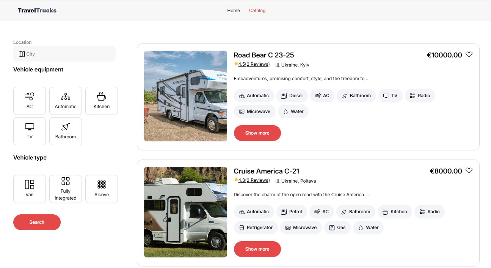

# Travel Trucks

### EN

[Travel Trucks](https://camper-trucks.vercel.app/) — a website for finding campers. The site allows users to search for campers according to filters, view details, photos, and reviews. Additionally, it allows users to add/remove selected campers to favorites and send a booking request.

* Integrated with a [server](https://66b1f8e71ca8ad33d4f5f63e.mockapi.io/campers) built on [mockapi.io](https://mockapi.io) via REST API.
* Implemented according to the [design](https://www.figma.com/design/6vTbzaB3EPgOreQz2jOJJe/Campers?node-id=17-11553&node-type=frame&t=orqxK05ExN2TtEa6-0).
* On the catalog page, location detection is automated using [opencagedata](https://api.opencagedata.com/).




## Content
- [Features](#Features)
- [Technologies](#Technologies)
- [Project Setup](#Project-Setup)

## Features
- **Homepage**: provides access to the catalog.
- **Catalog**: Users can browse, search for campers according to filters, and add/remove favorites.
- **Model Details**: Detailed information about each model, photo gallery, and reviews. Includes a form for sending booking requests.

## Technologies
This project is created using the following technologies:

- **Frontend**: React, React-redux, React-router, Redux-persist, React Toast, CSS
- **Backend**: [mockapi.io](https://mockapi.io)
- **Building**: [vite](https://vite.dev/)
- **Deployment**: [Vercel](https://vercel.com/kryvko-sergiis-projects/camper-trucks)

## Project Setup
To run the project locally, follow these steps:

1. Clone the repository:

   ```git clone https://github.com/KryvkoSergii/camper-trucks.git```

2. Install dependencies:

   ``` npm install```

3. Run the project:

   ``` npm run dev```

### UA

[Camper Trucks](https://camper-trucks.vercel.app/) — вебсайт для пошуку кемперів. Сайт дозволяє користувачам шукати кемпери відповідно до фільтру, переглядати їх деталі, фото та відгуки. Додатково дозволяє додати/видалити обраний кемпер до улюблених та відправити запит на бронювання.

* Здійснена інтеграція зі [сервером](https://66b1f8e71ca8ad33d4f5f63e.mockapi.io/campers), побудованого на [mockapi.io](https://mockapi.io), через REST API.
* Виконано відповідно до [дизайну](https://www.figma.com/design/6vTbzaB3EPgOreQz2jOJJe/Campers?node-id=17-11553&node-type=frame&t=orqxK05ExN2TtEa6-0)
* На сторінці каталогу автоматично визначає місцезнаходження за допомогою [opencagedata](https://api.opencagedata.com/) 


## Зміст

- [Особливості](#особливості)
- [Технології](#технології)
- [Запуск проєкту](#запуск-проєкту)

## Особливості
- **Головна сторінка (Home Page)**: дозволяє перейти до каталогу.
- **Перегляд каталогу (Catalog)**: Користувачі можуть переглядати, здійснювати пошук кемперів відповідно до фільтрфів та додавати/видаляти до улюблених.
- **Деталі моделі (Details)**: Деталі про кожну модель, фотогалерея та відгуки. Присутня форма для відправки запиту на бронювання.

## Технології

Проєкт створено з використанням таких технологій:

- **Frontend**: React, React-redux, React-router, Redux-persist, React Toast, CSS
- **Backend**: [mockapi.io](https://mockapi.io)
- **Building**: [vite](https://vite.dev/)
- **Deployment**: [Vercel](https://vercel.com/kryvko-sergiis-projects/camper-trucks)

## Запуск проєкту

Щоб запустити проєкт локально, виконайте такі кроки:

1. Клонуйте репозиторій:
   
   ```git clone https://github.com/KryvkoSergii/camper-trucks.git```
2. Проінсталюйте залежності 

   ``` npm install```
3. Запустіть проект 
   
   ``` npm run dev```